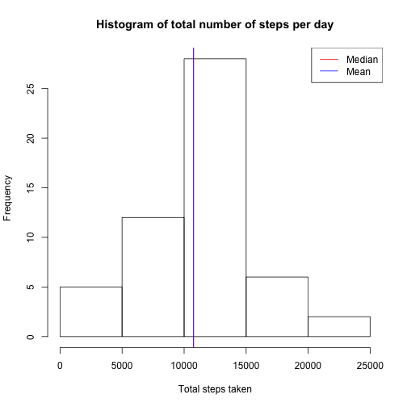
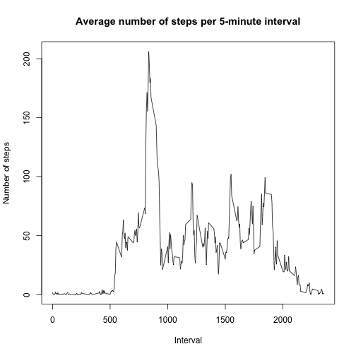
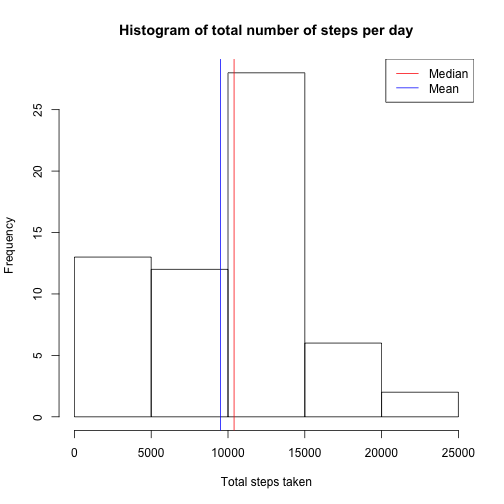
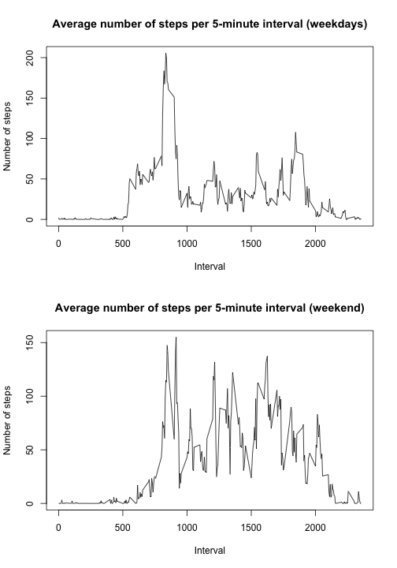

## Introduction
This report contains some analysis of data taken from a personal fitness device.
The data consists of of measurements of the number of steps taken by an
individual over a 2 month period, reported in 5-minute intervals.

The data consists of three variables:

  - **steps**: The number of steps recorded in the interval. (Missing values are
  recorded as NA.)
  - **date**: The date on which the measurement was taken in YYYY-MM-DD format.
  - **interval**: Identifier for the 5-minute interval in which measurement was
  taken.
  
  All data is available publicly [here](https://d396qusza40orc.cloudfront.net/repdata%2Fdata%2Factivity.zip).

## Loading and preprocessing the data
Here we first load all the activity data. We also create a "clean" data set,
comprising of the data without values for which the steps reading is recorded
as NA.

```r
data <- read.csv("activity.csv")
clean_data <- subset(data, is.na(steps) == FALSE)
```

## What is mean total number of steps taken per day?
We start off by aggregating the step data so that we have a result for the total
number of steps taken by the subject each day. Using this, we can then generate
a histogram of number of steps taken per day for all days in the measured
period.

Then we can calculate out the mean and medians of the number of steps taken per
data, and finally, mark their position on the histogram.

```r
steps_by_day <- aggregate(clean_data$steps, by=list(clean_data$date), FUN=sum)
names(steps_by_day) <- c("Date", "steps")
hist(steps_by_day$steps, main="Histogram of total number of steps per day",
     xlab="Total steps taken")
step_median <- median(steps_by_day$steps)
step_mean <- mean(steps_by_day$steps)
paste("Median steps per day: ", step_median)
```

```
## [1] "Median steps per day:  10765"
```

```r
paste("Mean steps per day: ", step_mean)
```

```
## [1] "Mean steps per day:  10766.1886792453"
```

```r
abline(v=step_median, col="red")
abline(v=step_mean, col="blue")
legend("topright", lwd=1, col=c("red", "blue"), legend=c("Median", "Mean"))
```



## What is the average daily activity pattern?
The next analysis looks at the subject's average daily activity pattern. First,
the number of steps across each five-minute interval of the day is averaged out
across all days. Then, this data can be graphed out as a time-series plot to
give a profile of the subject's daily activities and show when the subject is
most active in the number of steps taken.


```r
steps_by_interval <- aggregate(clean_data$steps, by=list(clean_data$interval),
                               FUN=mean)
names(steps_by_interval) <- c("interval", "steps")
with(steps_by_interval, plot(
  interval, steps, type="l", xlab="Interval", ylab="Number of steps",
  main="Average number of steps per 5-minute interval"))
```



Using this same data, the interval for which the maximum average number of steps
is taken can easily be identified.

```r
steps_by_interval[which.max(steps_by_interval$steps),]
```

```
##     interval    steps
## 104      835 206.1698
```

## Imputing missing values
An important note about the data computed above is that a number of the 
days/intervals in the original data were recorded as missing values (NAs) and
were therefore excluded from the analysis. However, the presence of missing
values may introduce some bias in the the calculations or summaries of the data.

Therefore, it may be better to devise a strategy to impute the missing values
for the data.

First we calculate and report the number of missing values in the dataset:

```r
nrow(subset(data, is.na(steps) == TRUE))
```

```
## [1] 2304
```

In the next step, the missing values from the original data set are filled in
with values imputed using a fairly simple strategy: the NA is replaced by the
median value for that interval across all days. If the value for that interval
is missing for all days, the NA is replaced with a 0.


```r
data2 <- read.csv("activity.csv")

median_steps_by_interval <- aggregate(clean_data$steps,
                                      by=list(clean_data$interval),
                                      FUN=median)
names(median_steps_by_interval) <- c("interval", "steps")

for (i in 1:nrow(data2)) {
  if (is.na(data2[i,]$steps)) {
    index <- which(median_steps_by_interval$interval == data2[i,]$interval)
    if (length(index) == 0) {
      data2[i,]$steps <- 0
    } else {
      data2[i,]$steps <- median_steps_by_interval[index, ]$steps
    }
  }
}
```

Now, it can be shown there are no more missing values in the dataset:

```r
nrow(subset(data2, is.na(steps) == TRUE))
```

```
## [1] 0
```

With the missing data filled in, a new histogram of the number of steps per day
can be generated from the data, and the new medians and means calculated:

```r
steps_by_day2 <- aggregate(data2$steps, by=list(data2$date), FUN=sum)
names(steps_by_day2) <- c("Date", "steps")
hist(steps_by_day2$steps, main="Histogram of total number of steps per day",
     xlab="Total steps taken")
step_median2 <- median(steps_by_day2$steps)
step_mean2 <- mean(steps_by_day2$steps)
paste("Median steps per day: ", step_median2)
```

```
## [1] "Median steps per day:  10395"
```

```r
paste("Mean steps per day: ", step_mean2)
```

```
## [1] "Mean steps per day:  9503.86885245902"
```

```r
abline(v=step_median2, col="red")
abline(v=step_mean2, col="blue")
legend("topright", lwd=1, col=c("red", "blue"), legend=c("Median", "Mean"))
```



The histogram with the imputed data shows a considerably different activity
profile than before. The addition of the imputed data lowers both the mean
and median number of steps taken per day. The effect of the imputed data was
largely to increase the frequency of the number of days with low step count, 
which has the effect of lowering the mean and median daily step count, and also
changing the graph profile.

## Are there differences in activity patterns between weekdays and weekends?
One last variable that may influence the data would be difference in activity
level between weekends and weekdays. To test this, a new factor variable is
introduced on the filled-in dataset, indicating whether each day is a weekday
or weekend.


```r
data2$day_of_week <- with(
  data2, ifelse(weekdays(
    as.Date(date)) == "Saturday" | weekdays(as.Date(date)) == "Sunday",
    "weekend", "weekday"))
```

Now, the previous time series plots showing average daily activity level can be
redone for weekdays and weekends, to show a more accurate activity profile.


```r
weekday_data <- subset(data2, day_of_week == "weekday")
weekday_steps_by_interval <- aggregate(weekday_data$steps,
                                       by=list(weekday_data$interval),
                                       FUN=mean)
names(weekday_steps_by_interval) <- c("interval", "steps")
weekend_data <- subset(data2, day_of_week == "weekend")
weekend_steps_by_interval <- aggregate(weekend_data$steps,
                                       by=list(weekend_data$interval),
                                       FUN=mean)
names(weekend_steps_by_interval) <- c("interval", "steps")

par(mfrow=c(2, 1))
with(weekday_steps_by_interval, plot(
  interval, steps, type="l", xlab="Interval", ylab="Number of steps",
  main="Average number of steps per 5-minute interval (weekdays)"))
with(weekend_steps_by_interval, plot(
  interval, steps, type="l", xlab="Interval", ylab="Number of steps",
  main="Average number of steps per 5-minute interval (weekend)"))
```



As can be seen, the weekday and weekend plots show very different activity
profiles.
